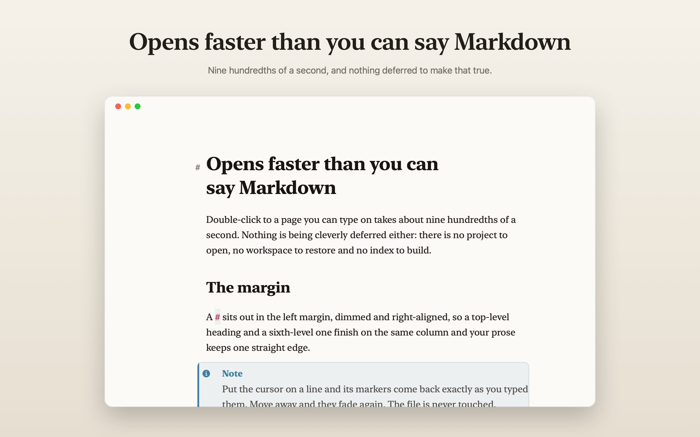

# Kvill

A full-screen Markdown editor for macOS. One file, one window, no sidebar.
Syntax markers hang in the left margin, dimmed and right-aligned, so
`#` and `######` finish on the same column and the text itself stays on one
clean line of measure.



Native AppKit. No Electron, no web view, no bundled runtime. About 0.09 seconds
from double-click to a page you can type on.

**Free on the Mac App Store.** No advertising, no in-app purchases, no account,
and no network access at all: the app ships without a network entitlement, so
macOS will not let it connect even if it tried.

## What it does

**Reads like a document, edits like plain text.** Bold is bold, headings are
headings, code sits in a panel. The Markdown underneath is never rewritten. What
you save is exactly what you typed.

**Markers appear where you are working.** `##`, `---`, code fences and `>` are
invisible until the caret enters that element, then they fade in dimmed in the
gutter. Nothing is inserted or removed to do this: the characters are still
there, kerned to zero width and painted in a clear colour.

**Every construct GitHub supports.** Headings (ATX and setext), bold, italic,
strikethrough, `==highlight==`, inline code, fenced code with a generic syntax
highlighter, indented code, links, reference links, autolinks, images,
footnotes, blockquotes at any depth, bulleted, ordered and task lists, tables,
horizontal rules, YAML front matter, definition lists, inline math, raw HTML,
and the five GitHub alerts:

> [!NOTE]
> Rendered as a tinted panel with an icon and a proper title, not as raw
> `[!NOTE]` text.

**Eight colour themes, five typefaces.** Paper, Ink, Sepia, Nord, the glass pair
Frost and Onyx, which put the page on the system's `.sidebar` material so the
desktop shows through the way it does in any other translucent macOS window, and
a high contrast pair for light and dark. The typefaces are Editorial (New
York), Grotesk (SF Pro),
Contrast (serif headings over a sans body), Typewriter (SF Mono) and Soft
(SF Rounded). Four text sizes, three measures. All of it app-wide and
remembered between launches, never per document.

**Chrome that stays out of the way.** A single glass dot in the top-right corner
springs open into three buttons as the pointer nears it, each holding a small
palette. A glass formatting bar appears over a selection. The file name sits
centred at the top of the page and fades away as soon as you scroll. A word count
sits quietly in the corner. `⌘.` hides all of it, title bar included.

The soft edge where content scrolls under the title bar is the system's own,
through `NSScrollEdgeEffectStyle` on a titlebar accessory. There is no AppKit
equivalent for the bottom of a window, so there is no bottom edge: a hand-drawn
one cost several milliseconds every frame and never matched it.

**Focus mode** dims every paragraph but the one you are in. **Typewriter
scrolling** keeps the caret centred, and the view scrolls past the end of the
document so the last line is never pinned to the bottom edge.

## Getting it

On the Mac App Store, free. Requires macOS 14 or later.

To build it yourself you need the Xcode Command Line Tools; full Xcode is not
required.

```sh
git clone https://github.com/the-baaron/kvill.git
cd kvill
./build.sh
open build/Kvill.app
```

Either drop a `.md` file on the icon, or choose
**Kvill › Make Kvill the Default Markdown Editor…** so double-clicking works
everywhere.

## Keyboard

| | |
| --- | --- |
| `⌘B` `⌘I` | Bold, italic |
| `⌃⌘S` `⌃⌘H` `⌃⌘C` | Strikethrough, highlight, inline code |
| `⌘K` `⇧⌘K` | Link, image |
| `⌘1`–`⌘6`, `⌘0` | Heading level, body text |
| `⇧⌘8` `⇧⌘7` `⇧⌘9` | Bulleted, numbered, task list |
| `⌘'` `⇧⌘C` `⌃⌘T` `⇧⌘-` | Quote, code block, table, rule |
| `⌘T` | Display options |
| `⌘.` | Hide every piece of interface |
| `⌃⌘]` `⌃⌘[` | Next theme, next typeface |
| `⌘+` `⌘-` `⌥⌘0` | Text size |
| `⇧⌘F` `⇧⌘Y` `⇧⌘M` | Focus mode, typewriter, always show markers |
| `⌃⌘F` | Full screen |

Return continues a list or quote and ends it on an empty item. Tab and Shift-Tab
indent list items. Clicking a checkbox toggles it. Command-clicking a link opens
it.

## Folders

**File › Open Folder…**, or drop a folder on the icon, and its Markdown files
appear down the side of the window. Click one to open it. Sub-folders are
included; folders with no Markdown in them are not.

Opening a folder does one other thing worth knowing: macOS then lets Kvill read
everything inside it, which is what makes images stored beside your documents
load. Kvill remembers the folders you have opened, so it only has to be done
once.

## Images

Drag an image in and Kvill writes the Markdown for it. A file already inside the
document's folder is referenced where it lies; anything from outside is copied
into an `images/` folder beside the document, under a name that is not already
taken. Image data dragged from a browser or Photos is written out the same way.

A line that is nothing but an image is drawn as the picture, with whatever text
the line carries falling underneath it as a centred caption. Put the caret in the
line and the Markdown reappears, so the path and the caption stay editable.

## Setext headings

`Title` over `=====` is converted to `# Title` when the file is opened, and `---`
under a paragraph is treated as a horizontal rule rather than promoting the line
above it to a heading. Both make setext headings awkward to live with in an
editor: the underline is a second line to keep in step, and typing a rule after a
paragraph silently turns it into a title. The conversion is left unsaved, so
opening a file never rewrites it on disk.

## Tables

A table is set in a monospace face and its source is padded with spaces, so the
columns line up by counting characters rather than by measuring cells. The
pipes stay visible, which is the point: what you see is the file, and the file
is what GitHub and a diff will show.

Padding is applied as you leave a table and again on save, so a table you typed
roughly ends up square without you lining it up by hand.

If the table would be wider than the measure it is set smaller, down to 62% of
the size the rest of the code is set at. Rows never wrap: a wrapped row would
put its cells under the wrong columns, so a row that still will not fit is
truncated instead.

## The command line

Kvill's binary does more than open windows. Every one of these draws or measures
the real app rather than a description of it, which is what makes them worth
pointing something else at.

    /Applications/Kvill.app/Contents/MacOS/Kvill --render notes.md out.png

**These are useful to an assistant working alongside you.** If you have asked an
agent to write or edit Markdown, it can render the result as an image and show
you what the page will actually look like, in the typeface and colours you read
in, without opening a window or touching what you have on screen. It can also
draw a folder's tree, or a specimen sheet of the typefaces, to ask which you
want. A render is a read: it puts every display setting back afterwards, in
memory and on disk, so taking a picture never changes your editor.

| Command | What it does |
| --- | --- |
| `--render in.md out.png` | Draws a page headlessly and writes a PNG |
| `--tree folder out.png` | Draws the folder sidebar for a real folder |
| `--specimens out.png` | Draws the typeface, size and width specimens |
| `--benchmark file.md` | Startup, per-keystroke and second-window timings |
| `--selftest` | Runs every runtime check and exits non-zero on failure |
| `--login-item [status\|on\|off]` | Reads or sets what macOS thinks of the login item |
| `--demo` | Drives the app through a scripted demonstration |

### Options for `--render`

| Option | Values | Default |
| --- | --- | --- |
| `--theme` | `paper`, `ink`, `sepia`, `nord`, `contrast-light`, `contrast-dark` | your current one |
| `--typography` | `editorial`, `grotesk`, `contrast`, `typewriter`, `soft` | your current one |
| `--size` | `small`, `medium`, `large` | your current one |
| `--geometry` | `WIDTHxHEIGHT` in points, e.g. `1010x708` | the window's size |
| `--scale` | a number, `2` for Retina | `2` |
| `--offset` | points to scroll down before drawing | `0` |

`--tree` takes `--theme` and `--size WxH`.

### Worth knowing before pointing a script at it

**Build without the sandbox for any of these.** The App Sandbox refuses to read
a path handed to the app on the command line, so `QUILL_SANDBOX=0 ./build.sh`
is required for a development build. The copy from the App Store is sandboxed
and will not read your file.

**A render draws the page, not the interface.** The floating chrome is glass,
and glass renders as nothing in a window that was never on screen, so an options
panel comes out empty. `--specimens` draws the parts of it that are ordinary
views, and `--selftest` interrogates the rest.

**Errors go to stderr and the exit code means something.** Nothing prints a
plausible-looking result when it failed to read its input.

## Known limits

- Images referenced beside a document need the folder to have been opened at
  least once. macOS grants access to what you chose, and a neighbouring file is
  not that; opening the folder grants all of it, and Kvill remembers.
- The emphasis matcher is a pragmatic approximation of the CommonMark flanking
  rules, not the full algorithm. It handles real prose, including `snake_case`,
  but a deliberately pathological nesting case may differ from a strict parser.
- Code highlighting is language-agnostic: comments, strings, numbers and a
  shared keyword set. It is not a per-language grammar.

## Licence

MIT. See [LICENSE](LICENSE).
